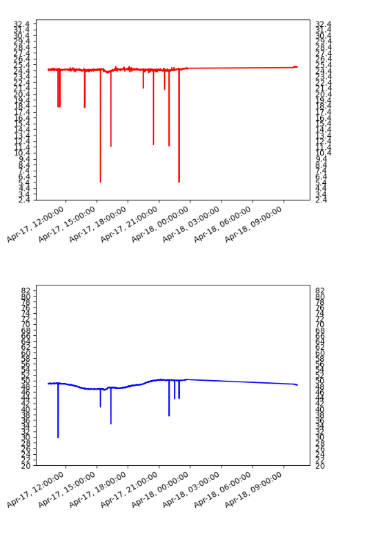

Simple raspberry Pi server with AM2302 DHT from Adafruit, using MariaDB server on LAN, and webpage with graphs generated, in Python.

$ docker build -t my-php-app .
$ docker run -d -p 80:80 --name my-running-app my-php-app
